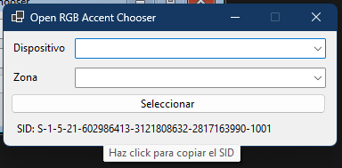

# OpenRGB Accent Chooser

**OpenRGB Accent Chooser** es una pequeña aplicación Windows Forms que guarda en el registro de Windows la configuración base necesaria para que el servicio [OpenRGB Accent Color Service](https://github.com/smukideejeah/OpenRGB-Accent-Color-Service) pueda funcionar correctamente.

## ¿Para qué sirve?

Permite seleccionar el dispositivo y la zona RGB que se usará para reflejar el color de énfasis del sistema, guardando esta información en el registro de Windows para que el servicio la utilice.

## Requisitos

- Windows 10/11
- [OpenRGB](https://openrgb.org/) ejecutándose en modo SDK Server
- .NET Framework (versión requerida por el proyecto)

## Instalación y uso

1. **Descarga o compila el ejecutable** desde el código fuente.
2. **Ejecuta la aplicación** (`Accent Chooser.exe`).
3. **Selecciona el dispositivo y la zona RGB** que deseas usar.
4. **Copia el SID** de tu usuario reflejado en el form.
5. **Pega el SID** en el archivo `appsettings.json` del servicio [OpenRGB Accent Color Service](https://github.com/smukideejeah/OpenRGB-Accent-Color-Service).

> El dispositivo elegido y la zona elegida se guarda en el registro de Windows en el usuario local.

## Licencia

Este proyecto está licenciado bajo la [GPL-3.0](LICENSE.txt).